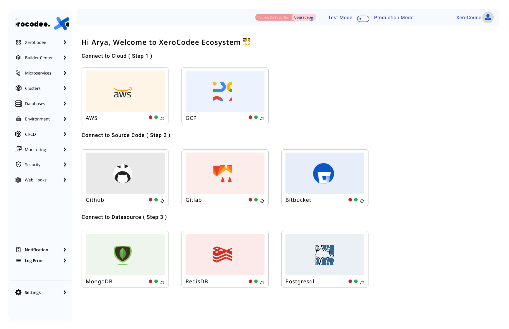

 

    
     
     
    <b>Seamless Deployment across Multi-Cloud, Hybrid</b>
    <b>no more, no less. Deploy from our single pane of glass, manage them with ease and scale up as fast as your workload grows.</b>
     
     
    

<h2>Save 1000s of expensive coder hours</h2>

<ul>
    <li>Infrastructure : Automated Cloud Infrastructure Workflow</li>
    <li>Security : Modern Secure Infrastructure Approach</li>
    <li>Networking : Flexible Secure Application Connectivity</li>
    <li>Applications : Automate Application Deployment for Agility</li>
</ul>

<h2>Connect With Us 🫂</h2>
<ul>
    <li>Join our <a href="https://github.com/orgs/xerocodee/discussions">Github Discussion</a></li>
    <li>Join our <a href="https://join.slack.com/t/xerocodee-workspace/shared_invite/zt-1u40v2902-1YLQZsCLUw8bN9dHa3Zudw">Slack Channel</a></li>
    <li>Follow us on <a href="https://www.linkedin.com/company/xerocodee/">LinkedIn</a></li>
</ul>